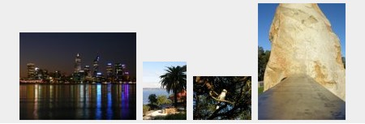
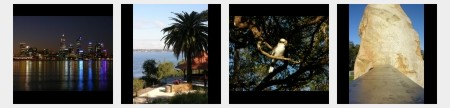

PIFS stands for "PHP Image Framing Script". It resamples images so they fit into a frame whilst maintaining their original aspect ratio.

It can turn this:



Into this:



You can easily host it on your web server (it's a single script) and then point your HTML image sources through it to resize them on-the-fly, like this:

```

```

Alternatively, you can use the Docker build and compose files included to spin PIFS up as a micro-service.

**Be careful** when hosting this script on production servers. Make sure the $allow_remote configuration is set to false to prevent anyone referencing your script remotely.

PIFS has been tested with PHP 7.4.6. It "may" work on earlier versions and "should" work on later versions.

PIFS uses PHP's bundled [GD library](https://www.php.net/manual/en/book.image.php) for image manipulation. That should be installed/enabled by default under most PHP setups (but check, if you run into issues).

See the script comments for additional documentation.